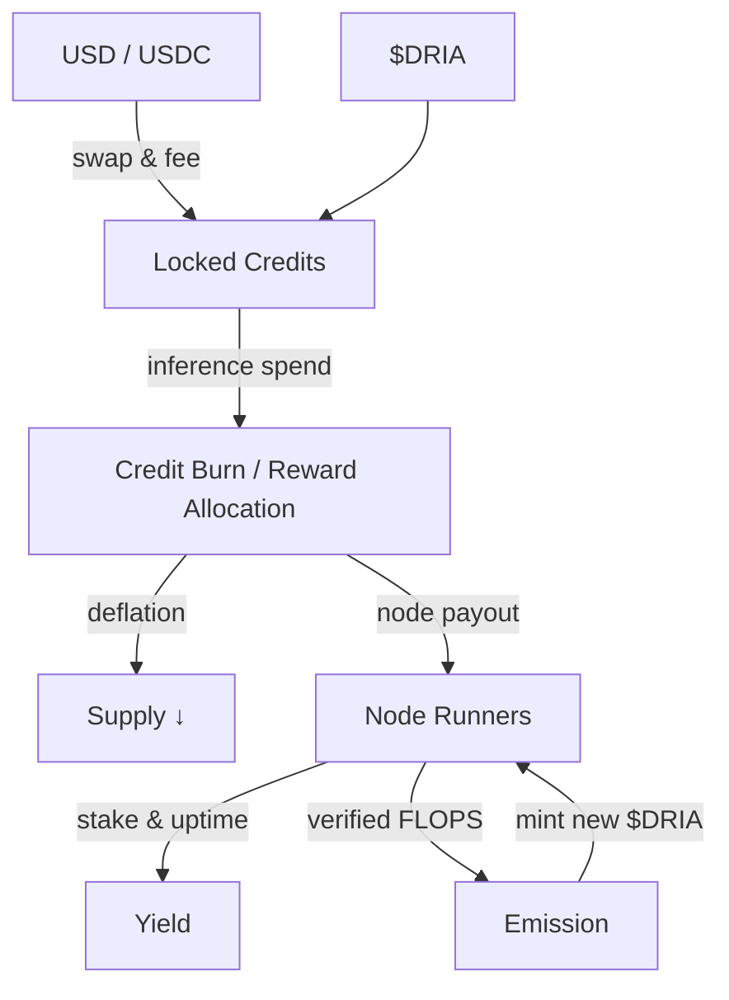
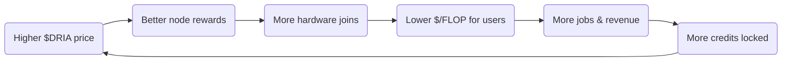

# Dria Tokenomics

<Note>  
For the math behind our verifiable‑inference proofs, see the peer‑reviewed [TOPLOC paper](https://arxiv.org/abs/2501.16007) and our [Technical Appendix](/appendix-toploc).  
</Note>

Dria turns idle silicon into a single, permissionless AI super‑fabric.
Every payment, proof, reward, and penalty is settled on Solana with the `$DRIA` token.
Our design goals are **transparency, long‑run sustainability, and perfectly aligned incentives.**

---

### Why the Model Works

* **Verifiable Compute** – Nodes commit lightweight TOPLOC proofs; bad shards are slashed, honest ones are paid.
* **Dual On‑Ramps** – Enterprises pay in USD/USDC or `$DRIA`; either way the funds become **locked credits** spendable only on compute.
* **Compute‑Linked Emission** – New tokens appear *only* when real FLOPS are delivered and verified.
* **Capped & Deflationary** – Total supply is fixed; on‑prem conversions and oracle calls burn tokens, compressing float as usage grows.

---

## Token Flow

---

## Economic Flywheel

**Self‑reinforcing loop:** usage locks revenue → burns supply → boosts token value → attracts more nodes → cuts cost → drives yet more usage.

---

## At a Glance

| Pillar                 | What Happens                                      | Why It Matters                                                 |
| ---------------------- | ------------------------------------------------- | -------------------------------------------------------------- |
| **Retention**          | All payments convert to non‑withdrawable credits. | Revenue can't "walk out" it funds only compute.                |
| **Emission**           | Rewards released only after proof‑of‑compute.     | Supply growth = real economic output, not speculation.         |
| **Deflation**          | Credits burned in on‑prem & oracle flows.         | Shrinks circulating supply as adoption rises.                  |
| **Staking & Slashing** | Nodes lock collateral; faulty work slashed.       | Keeps the network reliable without trusted parties.            |
| **Solana Settlement**  | Sub‑second finality, less than $0.001 fees.       | Makes on‑chain scheduling & micro‑rewards economically viable. |

---

Dria's tokenomics convert **electricity + spare silicon** into a globally auditable AI utility:

* **Sustainable**: Capped supply, disinflationary rewards.
* **Aligned**: Enterprises, developers, and hardware owners all win when the network is busy.
* **Trustless** : Every model run can be cryptographically proven.
* **Composable** : Built natively on Solana, ready to plug into any DePIN or AI stack.

To see Dria's tokenomics in action from an end-user perspective, check out our [User Experience](/docs/user-experience) walkthrough. It explains what it feels like to run AI on the Dria Network or inside your own data-center.

Dive deeper in the linked sections or spin up your first job and watch the credits flow.

Welcome to open, verifiable, planetary‑scale AI. 