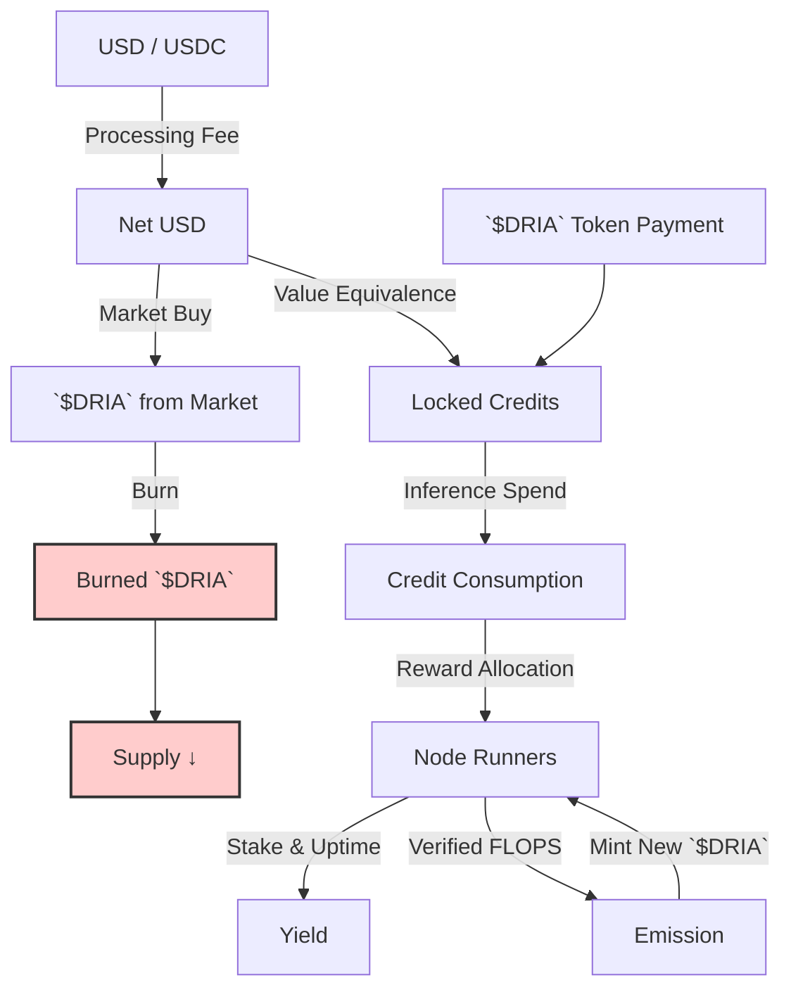
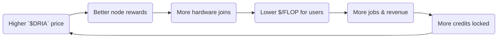

# Overview

<Note>  
For the math behind our verifiable‑inference proofs, see the peer‑reviewed [TOPLOC paper](https://arxiv.org/abs/2501.16007) and our [Technical Appendix](/appendix-toploc).  
</Note>

Dria turns idle silicon into a single, permissionless AI super‑fabric.
Every payment, proof, reward, and penalty is settled on Solana with the `$DRIA` token.
Our design goals are **transparency, long‑run sustainability, and perfectly aligned incentives.**

---

### Why the Model Works

* **Verifiable Compute**: Nodes commit lightweight TOPLOC proofs; bad shards are slashed, honest ones are paid.
* **Dual On‑Ramps & Deflation**: Enterprises pay in USD/USDC or `$DRIA`. USD payments are used to buy back `$DRIA` from the market, which is then burned. All payments result in **locked credits** spendable only on compute.
* **Compute‑Linked Emission**: New tokens appear *only* when real FLOPS are delivered and verified.
* **Capped & Aggressively Deflationary**: Total supply is fixed. `$DRIA` is burned when credits are purchased with USD, when on‑prem conversions occur, and during oracle calls—compressing float as usage grows.

---

## Token Flow

{/*

*/}

---

## Economic Flywheel

{/*

*/}

**Self‑reinforcing loop:** usage locks revenue → burns supply → boosts token value → attracts more nodes → cuts cost → drives yet more usage.

---

## At a Glance

| Pillar                 | What Happens                                                                 | Why It Matters                                                                      |
| ---------------------- | ---------------------------------------------------------------------------- | ----------------------------------------------------------------------------------- |
| **Retention**          | All payments convert to non‑withdrawable credits. USD payments buy & burn `$DRIA`. | Value is locked for compute. USD inflow actively reduces `$DRIA` supply.              |
| **Emission**           | Rewards released only after proof‑of‑compute.                                | Supply growth = real economic output, not speculation.                              |
| **Deflation**          | `$DRIA` burned on USD credit purchases, on‑prem conversions, & oracle flows.   | Aggressively shrinks circulating supply as adoption rises from multiple channels. |
| **Staking & Slashing** | Nodes lock collateral; faulty work slashed.                                  | Keeps the network reliable without trusted parties.                                 |
| **Solana Settlement**  | Sub‑second finality, less than $0.001 fees.                                  | Makes on‑chain scheduling & micro‑rewards economically viable.                      |

---

Dria's tokenomics convert **electricity + spare silicon** into a globally auditable AI utility:

* **Sustainable**: Capped supply, disinflationary rewards.
* **Aligned**: Enterprises, developers, and hardware owners all win when the network is busy.
* **Trustless**: Every model run can be cryptographically proven.
* **Composable**: Built natively on Solana, ready to plug into any DePIN or AI stack.

To see Dria's tokenomics in action from an end-user perspective, check out our [User Experience](/docs/user-experience) walkthrough. 

You can also dive deeper into specific aspects of our tokenomics:
- [Token Supply & Distribution](/docs/token-supply-distribution)
- [Payment Flows](/docs/payment-flows)
- [Core Economic Engine](/docs/core-economic-engine)
- [Node Incentives & Staking](/docs/node-incentives-staking)
- [Platform Architecture](/docs/platform-architecture)

Welcome to open, verifiable AI at planetary‑scale.