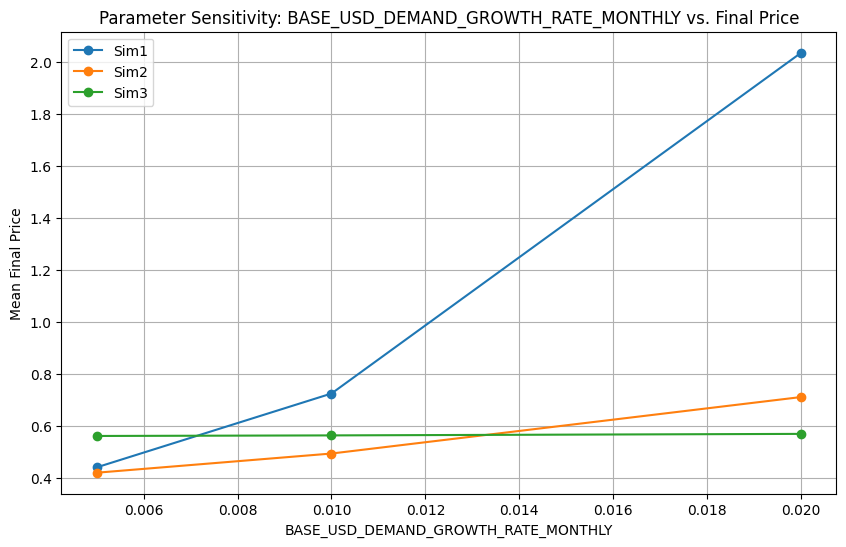
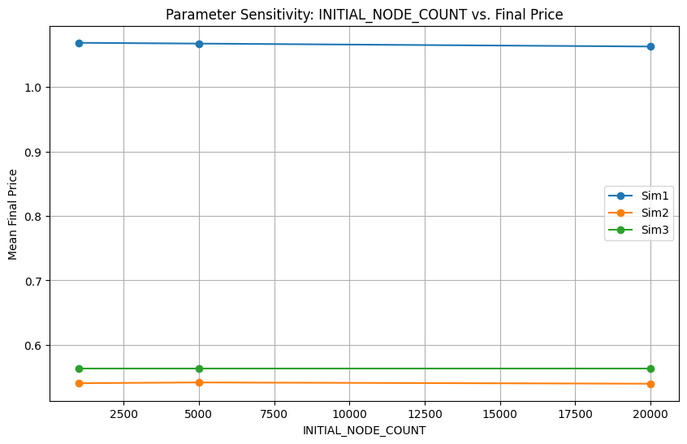

# Dria Tokenomics: Comparative Analysis & Strategic Recommendations

## 1. Introduction

This report provides a clear, actionable comparison of three tokenomics models for the Dria network. Each model was rigorously simulated across a wide range of parameters and market scenarios (Baseline, Bull, Bear, High Volatility) to assess performance, stability, and risk. The goal is to inform stakeholders about the trade-offs and suitability of each approach for Dria's future.

The models evaluated are:
*   **Model Alpha (Sim1):** The current design, emphasizing compute-linked emissions and deflationary mechanisms.
*   **Model Beta (Sim2):** A research-backed alternative featuring a halving-based emission schedule, performance-based rewards, and explicit governance structures.
*   **Model Gamma (BME | Sim3):** A benchmark model designed to be highly responsive to broader crypto market dynamics.

## 2. Simulation Run Configuration

To ensure a comprehensive understanding of each tokenomics model's behavior under diverse conditions, a robust simulation strategy was employed. This involved systematically varying key input parameters and subjecting each combination to multiple market scenarios.

### Parameter Sweep

The following parameters were varied to create a wide range of initial conditions and operational assumptions:

*   **`INITIAL_NODE_COUNT`**: \[1000, 5000, 20000] nodes
    *   Represents the initial size of the node ecosystem.
*   **`BASE_USD_DEMAND_GROWTH_RATE_MONTHLY`**: \[0.005 (0.5%), 0.01 (1%), 0.02 (2%)]
    *   The underlying monthly growth rate for demand denominated in USD.
*   **`INITIAL_DRIA_PRICE_USD`**: \[$0.25, $0.50, $1.00]
    *   The starting price of the DRIA token in USD.
*   **`MARKET_TREND_IMPACT_FACTOR`**: \[0.25, 0.50, 0.75]
    *   A multiplier determining how strongly external market trends influence demand growth (0 = no influence, 1 = full influence).
*   **`INITIAL_USD_CREDIT_PURCHASE_PER_MONTH`**: \[$50,000, $100,000, $200,000]
    *   The initial monthly volume of service payments made via USD credits.
*   **`INITIAL_DRIA_PAYMENTS_FOR_SERVICES_PER_MONTH`**: \[100,000, 200,000, 400,000] DRIA
    *   The initial monthly volume of service payments made directly with DRIA tokens.
*   **`SIMULATION_YEARS`**: \[5, 10] years
    *   The duration over which each simulation was run.

This combination of parameter values resulted in 3 x 3 x 3 x 3 x 3 x 3 x 2 = **1,458 unique parameter sets**.

### Market Scenarios

Each of the 1,458 unique parameter sets was simulated under four distinct market scenarios, derived from historical market data and designed to test model resilience:

1.  **Baseline:** Represents an average or expected market trajectory.
2.  **Bull:** Simulates a sustained positive market trend, amplifying demand.
3.  **Bear:** Simulates a sustained negative market trend, dampening demand.
4.  **High Volatility:** Simulates a market with significant and frequent fluctuations in trend.

### Total Simulations

By running each of the 1,458 parameter sets across all 4 market scenarios, a total of 1,458 * 4 = **5,832 simulation runs** were performed. Each individual run generated time-series data for all three tokenomics models (Model Alpha, Model Beta, Model Gamma), providing a rich dataset for comparative analysis.

## 3. Tokenomics Model Overviews

### 3.1. Model Alpha (Sim1)

- **Core Idea:** Rewards linked directly to network activity and utility, with deflationary pressures from service fees.
- **Supply & Emissions:** Capped supply with emissions primarily driven by compute demand and node participation.
- **Key Features:** Staking for yield, token burns from service payments, value retention through locked credits.
- **Pros:** Incentives directly tied to network usage, inherent deflationary aspects, simpler to understand and communicate.
- **Cons:** Emission schedule can be less predictable under fluctuating demand, lacks explicit treasury and advanced governance mechanisms.

### 3.2. Model Beta (Sim2)

- **Core Idea:** Predictable, Bitcoin-like emissions with a halving mechanism, performance-based rewards for network contributors, and a robust governance framework including a treasury.
- **Supply & Emissions:** Capped supply with a pre-defined emission schedule that halves every 4 years.
- **Key Features:** Distinct roles for contributors and validators, rewards based on uptime and FLOPs, dedicated treasury funded by emissions and fees, token-based governance.
- **Pros:** Transparent and predictable long-term emission schedule, dedicated funding for ecosystem development, strong incentive alignment for quality service.
- **Cons:** More complex than Model Alpha, fixed emission rate may not always perfectly align with short-term network growth or contraction.

### 3.3. Model Gamma (BME | Sim3)

- **Core Idea:** Token emissions and rewards are dynamically modulated by external market trends (e.g., overall crypto market, DePIN sector) and internal network demand. The design aims to create a dynamic equilibrium where, over time, the amount of DRIA burned from service fees could balance the amount of DRIA emitted as rewards, thereby stabilizing the token's price.
- **Supply & Emissions:** Highly adaptive and market-driven.
- **Key Features:** Designed for maximum responsiveness to external economic conditions.
- **Pros:** Potential to capitalize on broad market uptrends and self-adjust during downturns.
- **Cons:** Inherently less predictable for long-term financial planning, potential for higher volatility if market correlations are strong and negative.

## 4. Weaknesses of Each Tokenomics Mechanism

### 4.1. Model Alpha (Sim1)

- **Emission Predictability:** Emissions are closely tied to network activity and demand, which can fluctuate. This makes long-term supply and reward forecasting more difficult for both the team and participants.
- **Lack of Explicit Treasury/Governance:** There is no built-in mechanism for ecosystem funding or on-chain governance, which can limit the protocol's ability to adapt, fund growth, or respond to crises.
- **Deflation Reliance:** The model relies on deflationary mechanisms (burns) to counteract inflation, but if network usage drops, burns may be insufficient, leading to potential oversupply.
- **Staking Simplicity:** While simple, the staking mechanism may not optimally align incentives for long-term engagement or high-quality contributions.
- **Resilience to Shocks:** Although robust in many scenarios, the lack of adaptive levers (like a treasury or dynamic emissions) can make it less responsive to sudden market or demand shocks.

### 4.2. Model Beta (Sim2)

- **Complexity:** The model introduces more moving parts (halving, performance-based rewards, explicit validator/contributor roles, treasury, governance), which can be harder to communicate, implement, and govern.
- **Fixed Emission Schedule:** The halving schedule is predictable but inflexible. If network growth outpaces emissions, rewards may become too scarce; if growth lags, excess emissions could cause inflation.
- **Governance Risks:** On-chain governance and treasury management require active, informed participation. Poor governance can lead to misallocation of funds or protocol capture by special interests.
- **Performance Metrics:** Reliance on performance-based rewards (e.g., uptime, FLOPs) can be gamed or manipulated if not carefully designed and monitored.
- **Treasury Utilization:** If the treasury is not used effectively, it can become a source of inefficiency or even a target for exploitation.

### 4.3. Model Gamma (BME | Sim3)

- **High Volatility:** By design, emissions and rewards are highly sensitive to external market trends. This can lead to large swings in incentives, price, and network participation.
- **Unpredictability:** The model's adaptability can make it difficult for participants to plan or for the protocol to maintain stability, especially in turbulent markets.
- **Potential for Overreaction:** If market signals are noisy or manipulated, the protocol may overreact, amplifying booms and busts.
- **Lack of Long-Term Anchors:** Without a fixed supply or emission schedule, there is less certainty for long-term holders and planners.
- **Complex Tuning Required:** The model requires careful calibration of how much market trends influence emissions and demand, or it risks instability.

## 5. Simulation Settings Summary

Your simulations were designed to robustly test each model under a wide range of conditions. Here are the key settings and approaches:

- **Parameter Sweeps:** As detailed in Section 2, simulations tested different starting network sizes, demand growth rates, initial prices, and market trend sensitivities.
- **Market Scenarios:** Baseline (average), Bull (positive), Bear (negative), and High Volatility (large swings) scenarios were simulated, also detailed in Section 2.
- **Market Data Integration:** Real historical crypto and DePIN sector data were used to generate realistic market trend indices, which modulated demand growth in the simulations.
- **Simulation Duration:** Simulations ran for 5 or 10 years, with monthly timesteps, as part of the parameter sweep.
- **Metrics Tracked:** Final price, node count, APY, utilization, treasury balance, emissions, burns, failures (e.g., price < $0.10 or node count < 100), and more.
- **Robustness Testing:** By sweeping across many parameter combinations and market scenarios, the simulations assessed not just average outcomes but also the frequency and nature of failures or extreme results.

## 6. Simulation Highlights & Key Findings

Our simulations tested each model across numerous parameter combinations and four distinct market scenarios.

- **Overall Price Performance & Potential:**
    - **Model Beta (Sim2)** demonstrated the capacity for higher peak prices, especially in favorable (Bull) market conditions, but also exhibited a wider range of outcomes, including more significant downside risk in adverse scenarios.
    - **Model Alpha (Sim1)** generally produced more moderate and consistent price levels, showing less extreme highs and lows.
    - **Model Gamma (BME | Sim3)** showed the most considerable price fluctuations, directly reflecting its sensitivity to simulated market trends.
- **Stability and Robustness:**
    - **Model Alpha (Sim1)** consistently showed the highest stability, with the tightest distribution of final prices across varied scenarios. This indicates greater resilience to shocks and parameter variations.
    - **Model Beta (Sim2)**, while offering higher upside, was more sensitive to initial conditions and market sentiment, leading to greater variability in outcomes.
    - **Model Gamma (BME | Sim3)** was, by design, the most variable in its price outcomes.
- **Performance Across Market Scenarios:**
    - In **Bull Market** simulations, Model Beta (Sim2) and Model Gamma (BME | Sim3) generally captured more upside potential.
    - In **Bear Market** simulations, Model Alpha (Sim1) proved more defensive, maintaining value better than the more market-sensitive alternatives.
    - **High Volatility** scenarios amplified the characteristics of each model, with Model Alpha (Sim1) remaining relatively more stable.
- **Risk of "Failure" (Defined as price < $0.10 or node count < 100):**
    - **Model Beta (Sim2)** and **Model Gamma (BME | Sim3)** showed a higher number of instances where outcomes fell into this "failure" category, particularly under Bear market conditions or unfavorable parameter sets (e.g., low initial demand growth).
    - **Model Alpha (Sim1)** experienced fewer such extreme negative outcomes, underscoring its robustness.

## 7. Visual Insights from Simulations

The following charts, representative of those available in the project's `output` directory, illustrate these key findings.

### 7.1. Final Price Distribution by Model

This boxplot visualizes the range of final DRIA prices (USD) achieved by each model across all simulated scenarios and parameter settings. A shorter box and fewer outliers (dots) suggest more consistent and predictable pricing.

### 7.2. Model Robustness (Standard Deviation of Final Price)

This bar chart compares the standard deviation of the final DRIA price for each model. A lower bar indicates less price dispersion and thus greater stability and predictability over the range of tested conditions.

### 7.3. Mean Final Price by Market Scenario

This chart displays the average final DRIA price for each model under the different simulated market scenarios (Baseline, Bull, Bear, High Volatility), highlighting their responsiveness to broader market conditions.

### 7.4. Illustrative Summary Table (Baseline Scenario Focus)

For a simplified view, focusing on a typical "Baseline" market scenario, key performance indicators conceptually compare as follows. (Detailed CSVs in the `output` directory provide precise data across all scenarios).

| Metric                        | Model Alpha (Sim1) | Model Beta (Sim2) | Model Gamma (BME | Sim3) |
| :---------------------------- | :----------------- | :---------------- | :----------------------- |
| **Avg. Final Price (USD)**    | Moderate           | Higher Potential  | Highly Variable          |
| **Price Stability**           | High               | Medium            | Low                      |
| **Avg. Final Node Count**     | Steady Growth      | Potential High    | Variable                 |
| **Resilience to Low Demand**  | Medium-High        | Medium            | Low-Medium               |

*(Note: This table is a conceptual illustration. For exact figures and detailed breakdowns, please refer to the CSV files and full plot sets in the `output` directory, such as `final_price_summary_stats.csv` and the per-scenario results.)*

## 8. Strategic Considerations & Recommendations

The choice of tokenomics model is a critical strategic decision that should align with Dria's specific goals, risk tolerance, and developmental stage.

- **Model Alpha (Sim1):**
    - **Best Suited For:** Situations prioritizing stability, predictable growth, and resilience, especially in the early stages of network development or where a conservative risk profile is preferred.
    - **Key Advantage:** Robustness against adverse conditions and simpler initial mechanics.
    - **Considerations:** May offer less aggressive upside capture during strong bull markets compared to more dynamic models.
- **Model Beta (Sim2):**
    - **Best Suited For:** Projects with ambitious growth targets, a clear path to significant network demand, and the capacity for active governance and treasury management. Better deployed when the network has achieved some initial traction.
    - **Key Advantage:** Strong incentives for quality, predictable long-term supply, and a mechanism for ecosystem funding.
    - **Considerations:** Carries higher risk if demand growth falters or in sustained bear markets. Complexity requires robust community engagement and governance.
- **Model Gamma (BME | Sim3):**
    - **Best Suited For:** Primarily as a research benchmark or for experimental phases where understanding market correlation effects is paramount.
    - **Key Advantage:** Maximum adaptability to external market signals.
    - **Considerations:** Likely too unpredictable and potentially volatile for a primary production environment without substantial dampening mechanisms or further refinement.

**Recommended Path Forward:**

1.  **Review Simulation Outputs:** Stakeholders should examine the comprehensive simulation outputs (graphs, CSVs, tables) in the `output` directory to understand performance under specific parameter sets and market conditions.
2.  **Align on Risk & Growth:** Facilitate a strategic discussion to align on the desired balance between growth potential and risk tolerance.
3.  **Consider a Phased or Hybrid Approach:** It may be prudent to launch with a more stable model (like Model Alpha (Sim1)) and plan a future evolution to incorporate elements from Model Beta (Sim2) as the network matures, governance structures solidify, and demand becomes more established.
4.  **Develop Adaptive Strategies:** Regardless of the chosen model, identify key performance indicators (KPIs) from the simulations. For Model Beta (Sim2), in particular, define strategies for treasury deployment or parameter adjustments in response to real-world deviations from simulated conditions.

## 9. Conclusion

These simulations provide a data-driven foundation for making an informed decision on Dria's tokenomics. Model Alpha (Sim1) offers stability, Model Beta (Sim2) offers higher growth potential with managed risks, and Model Gamma (BME | Sim3) serves as a valuable, market-sensitive benchmark. The optimal choice will balance Dria's strategic ambitions with a realistic assessment of market conditions and internal capacities.

---
*This report is based on recent simulation data. All referenced charts and detailed output files are located in the project's `output` directory.*
---

## Appendix: Key Visualizations

*Fig 1: Final Node Count by Model (Baseline Scenario)*

*Fig 2: Final Price by Model (Baseline Scenario)*

*Fig 3: Frequency of Failure Cases*

*Fig 4: Final Price Distribution by Model (Boxplot)*

*Fig 5: Final Price Distribution (Histogram - All Scenarios)*

*Fig 6: Model Alpha (Sim1) - Final Price vs. Average APY*

*Fig 7: Model Alpha (Sim1) - Final Price vs. Average Utilization*

*Fig 8: Model Beta (Sim2) - Final Price vs. Average Utilization*

*Fig 9: Parameter Sensitivity - USD Demand Growth Rate vs. Final Price*

*Fig 10: Parameter Sensitivity - Initial DRIA Payments vs. Final Price*

*Fig 11: Parameter Sensitivity - Initial DRIA Price vs. Final Price*

*Fig 12: Parameter Sensitivity - Initial Node Count vs. Final Price*

*Fig 13: Parameter Sensitivity - Initial USD Credit Purchase vs. Final Price*

*Fig 14: Parameter Sensitivity - Market Trend Impact Factor vs. Final Price*

*Fig 15: Parameter Sensitivity - Simulation Years vs. Final Price*

*Fig 16: Robustness - IQR of Final Price by Model*

*Fig 17: Robustness - Standard Deviation of Final Price by Model*

*Fig 18: Mean Final Price by Model and Market Scenario*

*Fig 19: Final Price Distribution by Model and Market Scenario (Boxplot)* 