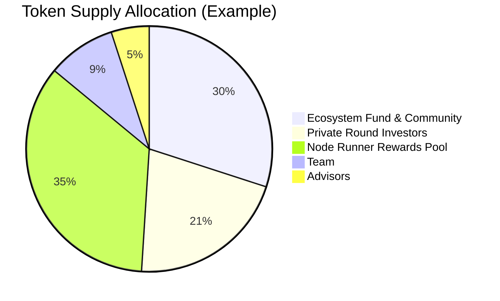

## Token Supply & Distribution

### **Design Principles Before Percentages**
Dria's token supply is governed by three core principles:
- **Capped Supply:** The total number of `$DRIA` tokens is strictly limited to ensure long-term scarcity and value alignment.
- **Delayed Team Unlocks:** Tokens allocated to the founding team and advisors are subject to extended lockups and gradual vesting, ensuring alignment with the network's long-term success.
- **Compute-Linked Emissions:** New `$DRIA` tokens are only emitted as rewards for verifiable compute delivered to the network, directly tying supply growth to real-world utility and demand.

These principles guide all supply and allocation decisions. The following numbers are placeholders and will be finalized prior to launch.

### **A. Total and Initial Supply**
- **Total Maximum Supply:** The total supply of `$DRIA` tokens is capped at 1,000,000,000 (1 billion) `$DRIA`.
- **Initial Circulating Supply:** At genesis, a portion of the total supply will be in circulation, with the remaining tokens locked and released according to the emission schedule and vesting periods detailed below.

### **B. Allocation Categories**
The total `$DRIA` supply is allocated across key areas to foster long-term growth and network health:

| Category | Percentage | Tokens | Vesting/Release |
|----------|------------|--------|-----------------|
| **Node Runner Rewards Pool (Emissions)** | 35% | 350,000,000 | Released over 10 years as compute rewards |
| **Ecosystem Fund & Community Incentives** | 30% | 300,000,000 | Strategic releases for grants, development programs, and user adoption |
| **Private Round Investors** | 16% | 160,000,000 | Completed private rounds |
| **Current Investment Round** | 5% | 50,000,000 | Ongoing at $240M valuation |
| **Team** | 9% | 90,000,000 | 12-month cliff, then monthly linear vesting over 36 months |
| **Advisors** | 5% | 50,000,000 | 12-month cliff, then monthly linear vesting over 24 months |

### **C. Vesting and Release Schedules**

#### **Private Round Investors (16%)**
Tokens allocated to early investors follow a vesting schedule designed to align long-term interests while providing liquidity at appropriate intervals.

#### **Current Round (5%)**
The ongoing investment round at $240M valuation will follow similar vesting terms to ensure alignment with long-term network success.

#### **Team (9%)**
- 12-month cliff from network launch
- Linear monthly vesting over 36 months thereafter

#### **Advisors (5%)**
- 12-month cliff from network launch
- Linear monthly vesting over 24 months thereafter

#### **Node Runner Rewards Pool (35%)**
Tokens are released according to the detailed emission schedule found in the [Core Economic Engine](/docs/core-economic-engine) section, following a disinflationary curve from 14% in Year 1 to 2% in Year 10.
