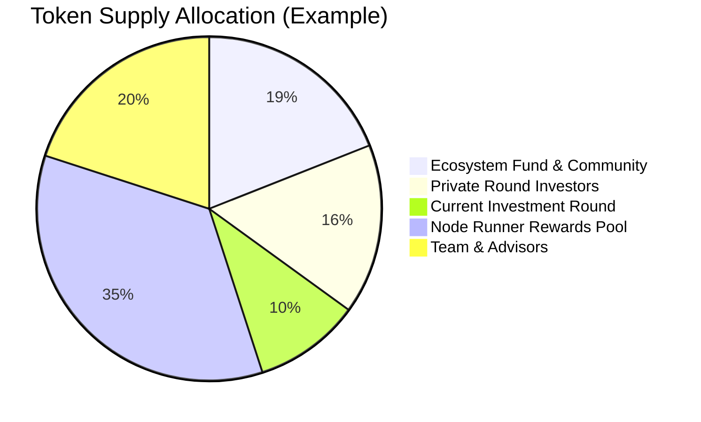

## Token Supply & Distribution

### **Design Principles Before Percentages**
Dria's token supply is governed by core principles designed to support its mission of enabling widespread, frictionless access to advanced multimodal models:
- **Capped Supply:** The total number of `$DRIA` tokens is strictly limited. This scarcity, combined with the token's utility as the primary means to access powerful inference capabilities, ensures long-term value alignment.
- **Delayed Team Unlocks:** Tokens allocated to the founding team and advisors are subject to extended lockups and gradual vesting, ensuring alignment with the network's long-term success in delivering advanced compute capabilities.
- **Compute-Linked Emissions:** New `$DRIA` tokens are only emitted as rewards for verifiable compute delivered to the network, directly tying supply growth to real-world utility and demand for inference.
- **Facilitating the Trading Compute Model:** The tokenomics are designed to enable a virtuous cycle where providing compute earns tokens that can be reinvested to access inference, fostering deep retention of value in the ecosystem.

These principles guide all supply and allocation decisions. The following numbers are placeholders and will be finalized prior to launch.

### **A. Total and Initial Supply**
- **Total Maximum Supply:** The total supply of `$DRIA` tokens is capped at 1,000,000,000 (1 billion) `$DRIA`. This finite supply underpins its role as the key to accessing advanced multimodal inference.
- **Initial Circulating Supply:** At genesis, a portion of the total supply will be in circulation, with the remaining tokens locked and released according to the emission schedule and vesting periods detailed below.

### **B. Allocation Categories**
The total `$DRIA` supply is allocated across key areas to foster long-term growth and the health of the distributed inference network:

| Category | Percentage | Tokens | Vesting/Release |
|----------|------------|--------|-----------------|
| **Node Runner Rewards Pool (Emissions)** | 35% | 350,000,000 | Released over 10 years as rewards for providing compute to serve multimodal models |
| **Ecosystem Fund & Community Incentives** | 19% | 190,000,000 | Strategic releases for grants, development programs focused on advanced models, and user adoption |
| **Private Round Investors** | 16% | 160,000,000 | Completed private rounds |
| **Current Investment Round** | 10% | 100,000,000 | Ongoing |
| **Team & Advisors** | 20% | 200,000,000 | 12-month cliff, then monthly linear vesting over 36 months |

### **C. Vesting and Release Schedules**

#### **Private Round Investors (16%)**
Tokens allocated to early investors follow a vesting schedule designed to align long-term interests with the growth of the distributed inference network, while providing liquidity at appropriate intervals.

#### **Current Round (10%)**
The ongoing investment round will follow similar vesting terms to ensure alignment with long-term network success in serving powerful multimodal models.

#### **Team & Advisors (20%)**
- 12-month cliff from network launch
- Linear monthly vesting over 36 months thereafter

#### **Node Runner Rewards Pool (35%)**
Tokens are released according to the detailed emission schedule found in the [Core Economic Engine](/docs/core-economic-engine) section, following a disinflationary curve from 14% in Year 1 to 2% in Year 10. This rewards the provision of compute for running advanced multimodal models, reinforcing the core principle of trading idle compute for inference access.
