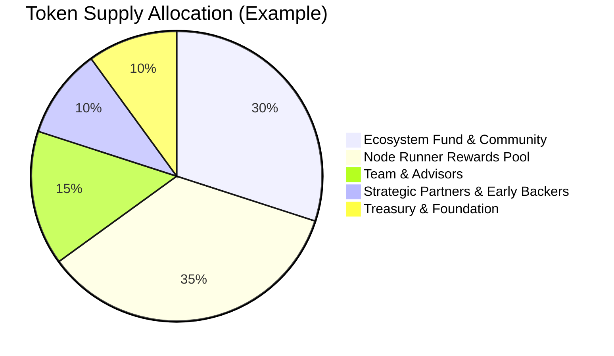

## Token Supply & Distribution

### **Design Principles Before Percentages**
Dria's token supply is governed by three core principles:
- **Capped Supply:** The total number of `$DRIA` tokens is strictly limited to ensure long-term scarcity and value alignment.
- **Delayed Team Unlocks:** Tokens allocated to the founding team and advisors are subject to extended lockups and gradual vesting, ensuring alignment with the network's long-term success.
- **Compute-Linked Emissions:** New `$DRIA` tokens are only emitted as rewards for verifiable compute delivered to the network, directly tying supply growth to real-world utility and demand.

These principles guide all supply and allocation decisions. The following numbers are placeholders and will be finalized prior to launch.

### **A. Total and Initial Supply**
- **Total Maximum Supply:** The total supply of `$DRIA` tokens is capped at [e.g., 1,000,000,000] `$DRIA`.
- **Initial Circulating Supply:** At genesis, approximately [e.g., 25]% of the total supply, amounting to [e.g., 250,000,000] `$DRIA`, will be in circulation. The remaining tokens are locked and will be released according to the emission schedule and vesting periods.

### **B. Allocation Categories (Placeholders)**
The total `$DRIA` supply is allocated across key areas to foster long-term growth and network health:
- **Ecosystem Fund & Community Incentives:** [e.g., 30]% - Dedicated to grants, developer programs, community building, and user adoption initiatives.
- **Node Runner Rewards Pool (Emissions):** [e.g., 35]% - Tokens allocated for future emission as rewards to node runners over an extended period, as detailed in the Emission Schedule.
- **Team & Advisors:** [e.g., 15]% - Subject to a [e.g., 12-month] cliff and [e.g., 36-month] linear vesting schedule to align long-term interests.
- **Strategic Partners & Early Backers:** [e.g., 10]% - Subject to specific lock-up and vesting schedules.
- **Treasury & Foundation Reserve:** [e.g., 10]% - For operational costs, future development, strategic partnerships, and maintaining network stability.

#### Example: Token Supply Allocation Chart

