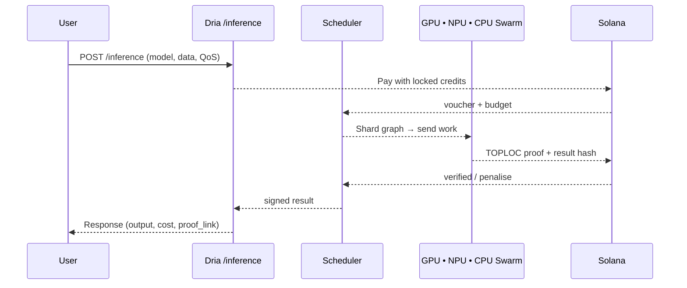

## End‑User Experience

Dria hides the complexity of distributed hardware, on‑chain incentives and verifiable proofs behind one unified workflow.
Whether you burst to thousands of peer‑to‑peer nodes or keep everything on‑prem, the surface‑area for engineers and finance teams is identical.

### 1. Buying Credits

| Option                   | How It Works                                                                                                                               | Result                                                                 |
|--------------------------|--------------------------------------------------------------------------------------------------------------------------------------------|------------------------------------------------------------------------|
| USD / Stable‑coin (USDC) | Pay invoice or swipe card → Dria uses the USD to buy `$DRIA` from the market at the daily TWAP (minus ~1–2% FX fee), then burns these `$DRIA`. | `$DRIA`-equivalent credits appear in your dashboard, locked for compute spend. The burn reduces `$DRIA` supply. |
| Direct `$DRIA`             | Send tokens straight to your project wallet; no fee.                                                                                       | Credits top‑up instantly, 1:1.                                         |

**Credits represent value for compute:** USD payments result in a `$DRIA` burn, while direct `$DRIA` payments lock up existing tokens. All credits can only be spent on FLOPS.


### 2. Running on the Dria Network



1. **Submit** – Curl, SDK, or REST; specify model name, max latency, budget ceiling.
2. **Atomic Pay + Match** – In the same Solana block the contract:
   * debits your credits,
   * shards the graph, solves for cheapest + fastest node mix,
   * escrows rewards.
3. **Execution** – GPUs in SF, NPUs in Berlin, CPUs in Bangalore run their slices in parallel.
4. **Proof & Payout** – Nodes post TOPLOC proofs; good shards auto‑claim rewards, bad shards are re‑queued and slashed.
5. **Retrieve** – You receive the stitched result, cost breakdown, and a link to the on‑chain proof tx.

### 3. Running On‑Prem with Dria License

Same compiler, same APIs only the target cluster changes.

1. **Install** – `pip install dnet && dnet init` on your cluster.
2. **License Activation** – Point the CLI to your project wallet; credits are already there.
3. **Compile Once** – Dria's topology‑aware compiler inspects your racks (H100s next to EPYC CPUs, maybe a few NPUs), auto‑shards the model, and stores a binary plan.
4. **Serve /train /inference** – Hit the same REST endpoints your devs use against the public network.
5. **Idle Compute Back‑haul (opt‑in)** – Flag `--export-idle`; when utilisation < X% the cluster back‑fills network jobs, earning `$DRIA` that are instantly burnt into fresh credits slashing your effective TCO.

**Accounting looks like this:**

| Flow | Credits | Token Effect |
|------|---------|--------------|
| You buy $10k USD → credits | +10k    | -10k worth of `$DRIA` bought & burned from supply |
| You run jobs on‑prem | −8k     | none (credits consumed) |
| You export 200 GPU‑hr idle | +2k (credits earned via `$DRIA`) | `$DRIA` earned by your compute is then converted to credits (typically involving a burn of those earned `$DRIA`, further reducing supply) |

Result: significantly reduced net spend due to on-prem contributions, strong deflationary pressure on the `$DRIA` token from both initial USD purchases and on-prem idle compute conversion, and 100% utilisation of your silicon.

### 4. Why Sharding & Scheduling Matter to You
* **No single device limit** – 70B Llama on an RTX‑4090? The compiler streams KV‑cache across three consumer cards + one CPU.
* **Hardware at fair value** – The scheduler bids CPUs for tokenisation, GPUs for dense MatMuls, NPUs for low‑precision GEMMs so you pay the blend, not H100 sticker shock.
* **Predictable UX** – Credits debit only after proof; latencies are enforced on‑chain; every run is auditable in the explorer.

### TL;DR for Builders

```bash
# 3‑line quick‑start (network)
export DRIA_KEY=<your wallet>
curl -X POST https://api.dria.co/inference \
     -H "Authorization: Bearer `$DRIA`_KEY" \
     -d '{"model":"gemma-7b","inputs":[...]}'

# same code, private cluster
dnet serve --model gemma-7b --gpu 4 --cpu 2
```

One credit balance, one API, global silicon.