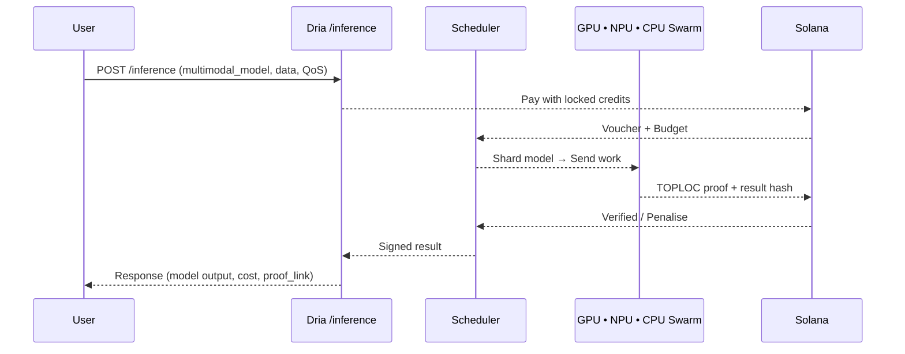

## Trading Compute for Model Access: The User Experience

Dria hides the complexity of distributed hardware, on‑chain incentives, and verifiable proofs behind one unified workflow specifically designed for trading compute for inference. Whether you're accessing powerful multimodal models through the network or contributing your own hardware, the surface-area for engineers and finance teams remains identical.

### 1. Getting Access to Models: Credits and Compute

| Access Method                   | How It Works                                                                                                                               | Result                                                                 |
|--------------------------|--------------------------------------------------------------------------------------------------------------------------------------------|------------------------------------------------------------------------|
| USD / Stable‑coin (USDC) | Pay invoice or swipe card → Dria uses the USD to buy `$DRIA` from the market at the daily TWAP (minus ~1–2% FX fee), then burns these `$DRIA`. | `$DRIA`-equivalent credits appear in your dashboard, locked for model inference. The burn reduces `$DRIA` supply, creating deflationary pressure. |
| Direct `$DRIA` Payment          | Send tokens straight to your project wallet; no fee.                                                                                       | Credits for model inference top‑up instantly, 1:1.                                         |
| Contributing Compute    | Provide compute resources to the network, earning tokens.                                                                             | Earn `$DRIA` tokens that can be converted to credits for accessing models yourself. |

**Credits represent access rights to multimodal models:** USD payments result in a `$DRIA` burn (increasing scarcity), while direct `$DRIA` payments and compute contributions lock value within the ecosystem. All credits can only be spent on model inference, ensuring value remains in the system.


### 2. Accessing Powerful Models on the Dria Network



1. **Submit** – Curl, SDK, or REST; specify the multimodal model name (e.g., a 70B+ parameter model), max latency, budget ceiling.
2. **Atomic Pay + Match** – In the same Solana block the contract:
   * debits your credits,
   * shards the model across distributed hardware, solves for cheapest + fastest node mix,
   * escrows rewards for compute providers.
3. **Execution** – GPUs in SF, NPUs in Berlin, CPUs in Bangalore run their slices of the model in parallel.
4. **Proof & Payout** – Nodes post TOPLOC proofs; good shards auto‑claim rewards, bad shards are re‑queued and slashed.
5. **Retrieve** – You receive the stitched model result, cost breakdown, and a link to the on‑chain proof tx.

### 3. Contributing Compute and Trading It for Inference

Same compiler, same APIs—only the direction of the compute trade changes.

1. **Install** – `pip install dnet && dnet init` on your cluster.
2. **License Activation** – Point the CLI to your project wallet; credits earned from your compute contributions are already there.
3. **Compile Once** – Dria's topology‑aware compiler inspects your racks (H100s next to EPYC CPUs, maybe a few NPUs), auto‑shards large multimodal models, and stores a binary plan.
4. **Dual Usage** – Use your hardware for your own models while also contributing to the network:
   * **Your Models**: Hit the same REST endpoints for your own inference needs.
   * **Trade Idle Compute** – Flag `--export-idle`; when utilisation < X% the cluster contributes to network inference tasks, earning `$DRIA` that are instantly converted into fresh credits for your own model inference, drastically reducing your effective TCO.

**The Trading Compute Model in Action:**

| Flow | Credits | Token Effect | Value Proposition |
|------|---------|--------------|-------------------|
| You buy $10k USD → credits | +10k credits    | -10k worth of `$DRIA` bought & burned from supply | Direct financial access to models |
| You run your own models on‑prem | −8k credits     | none (credits consumed) | Models run on your terms |
| You export 200 GPU‑hr idle compute | +2k credits (earned via `$DRIA`) | `$DRIA` earned by your compute is converted to credits (typically with partial burn) | **Trading idle compute for inference access** |

Result: Significantly reduced net spend by trading your idle compute for inference credits, strong deflationary pressure on the `$DRIA` token, and 100% utilisation of your silicon—exactly the core value proposition of Dria's tokenomics.

### 4. Why Dria's Architecture Enables Trading Compute for Inference
* **Access to Advanced Models** – Run powerful 70B+ parameter models beyond the capabilities of single devices. The compiler streams model states across multiple distributed resources, enabling access to models that would otherwise be out of reach.
* **Efficient Resource Utilization** – The scheduler intelligently allocates different model components to optimal hardware: CPUs for tokenisation, GPUs for dense MatMuls, NPUs for low‑precision operations. This means both efficient use of your contributed compute and cost-effective access to others' compute.
* **Trustless Trading of Compute** – Credits debit only after cryptographic proof; latencies are enforced on‑chain; every model inference is auditable in the explorer. This creates the trust necessary for a global marketplace where compute is freely tradable for inference rights.

### TL;DR for Multimodal Model Users

```bash
# 3‑line quick‑start (accessing models via the network)
export DRIA_KEY=<your wallet>
curl -X POST https://api.dria.co/inference \
     -H "Authorization: Bearer `$DRIA`_KEY" \
     -d '{"model":"powerful-multimodal-model","inputs":[...]}'

# same code, trading your own compute resources
dnet serve --model powerful-multimodal-model --gpu 4 --cpu 2 --export-idle
```

One credit balance, one API, global trading of compute for inference.