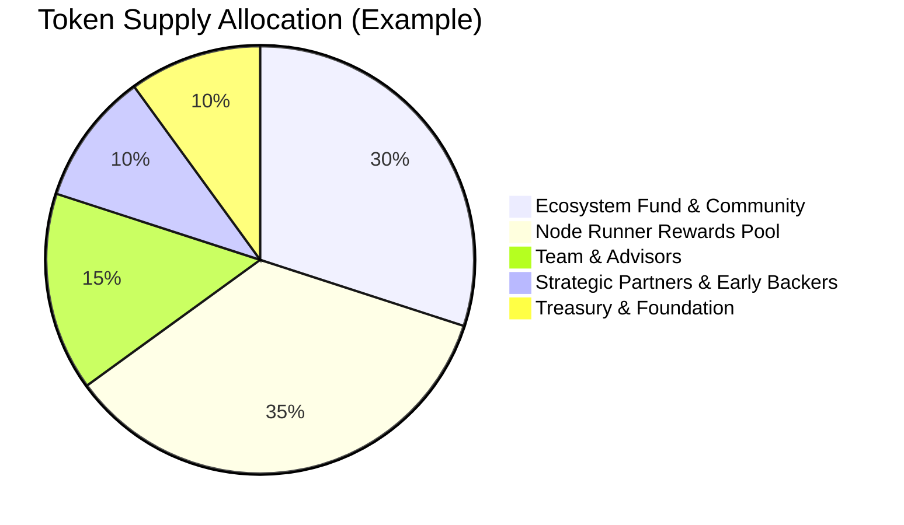
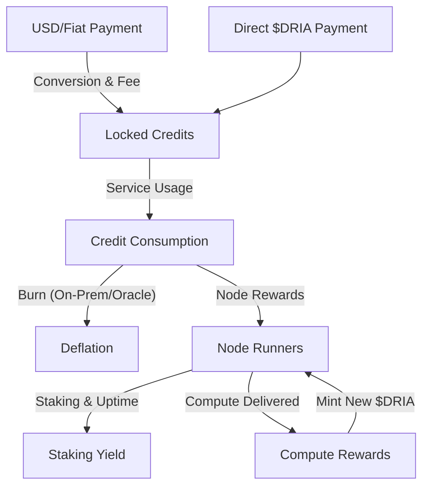

# Dria Tokenomics: Comprehensive Overview

---

## Token Supply & Distribution

+### **Design Principles Before Percentages**
+Dria's token supply is governed by three core principles:
+- **Capped Supply:** The total number of $DRIA tokens is strictly limited to ensure long-term scarcity and value alignment.
+- **Delayed Team Unlocks:** Tokens allocated to the founding team and advisors are subject to extended lockups and gradual vesting, ensuring alignment with the network's long-term success.
+- **Compute-Linked Emissions:** New $DRIA tokens are only emitted as rewards for verifiable compute delivered to the network, directly tying supply growth to real-world utility and demand.
+
+These principles guide all supply and allocation decisions. The following numbers are placeholders and will be finalized prior to launch.

### **A. Total and Initial Supply**
- **Total Maximum Supply:** The total supply of $DRIA tokens is capped at [e.g., 1,000,000,000] $DRIA.
- **Initial Circulating Supply:** At genesis, approximately [e.g., 25]% of the total supply, amounting to [e.g., 250,000,000] $DRIA, will be in circulation. The remaining tokens are locked and will be released according to the emission schedule and vesting periods.

### **B. Allocation Categories (Placeholders)**
The total $DRIA supply is allocated across key areas to foster long-term growth and network health:
- **Ecosystem Fund & Community Incentives:** [e.g., 30]% - Dedicated to grants, developer programs, community building, and user adoption initiatives.
- **Node Runner Rewards Pool (Emissions):** [e.g., 35]% - Tokens allocated for future emission as rewards to node runners over an extended period, as detailed in the Emission Schedule.
- **Team & Advisors:** [e.g., 15]% - Subject to a [e.g., 12-month] cliff and [e.g., 36-month] linear vesting schedule to align long-term interests.
- **Strategic Partners & Early Backers:** [e.g., 10]% - Subject to specific lock-up and vesting schedules.
- **Treasury & Foundation Reserve:** [e.g., 10]% - For operational costs, future development, strategic partnerships, and maintaining network stability.

#### Example: Token Supply Allocation Chart

---

## 1. Payment Flows: Dual On-Ramps

Dria supports two primary payment flows for enterprise and developer users:

### **A. USD / Fiat / Stablecoin Payments**
- **Process:**
    1. Users pay in USD (or stablecoins like USDC).
    2. Dria manages a dedicated wallet for each customer.
    3. The system deducts a small conversion fee (~1-2%).
    4. At regular intervals (daily/weekly), the protocol converts the net USD to $DRIA tokens at the current market rate.
    5. These convert to **locked credits** in the user's account (non-withdrawable).
    6. All network activity consumes these locked credits.

### **B. Direct $DRIA Token Payments**
- **Process:**
    1. Users pay directly with $DRIA tokens from their wallets.
    2. The protocol converts 100% of these tokens to locked credits with no fee.
    3. Credits become immediately available for network usage.

**Unified Credit System:**
All payments (fiat or crypto) become locked credits that users can only spend on network services, ensuring revenue retention within the ecosystem.

---

## 2. Token Flow Diagram

---

## 3. Token Economics

### **Retention** – *value stays in the ecosystem*
The protocol locks all payments as non-withdrawable credits, which users can only spend on network services. This creates continuous demand and value retention.

### **Inflation** – *supply grows only after compute delivered*
- The protocol mints new $DRIA tokens only as rewards for node runners from the "Node Runner Rewards Pool" allocation, after verifying their compute delivery (measured in FLOPS).
- **Emission Period:** Rewards distribute over [e.g., 10 years], ensuring sustainable network growth.
- **Disinflationary Model:** Annual emissions decrease from [~8-10%] in early years to [~1-2%] in later years. This controlled approach manages inflation while consistently rewarding node participation.

#### Example: Emission Schedule Table (Placeholders)

| Year | Annual Emission (%) | Tokens Emitted (Example) | Cumulative Emitted |
|------|---------------------|--------------------------|--------------------|
| 1    | 10%                 | 35,000,000               | 35,000,000         |
| 2    | 8%                  | 28,000,000               | 63,000,000         |
| 3    | 6%                  | 21,000,000               | 84,000,000         |
| 4    | 4%                  | 14,000,000               | 98,000,000         |
| 5-10 | 2%/yr               | 7,000,000/yr             | 140,000,000        |

*This table is for illustration. Actual schedule will be finalized before launch.*

**Concrete Example: Inflation Schedule**

Suppose the Node Runner Rewards Pool starts with 35% of a 1,000,000,000 $DRIA supply (i.e., 350,000,000 $DRIA). In Year 1, the protocol emits 10% of this pool (35,000,000 $DRIA) as rewards. In Year 2, it emits 8% (28,000,000 $DRIA), and so on, following the table above. This means the emission rate slows over time, making $DRIA scarcer as the network matures.

### **Deflation** – *token burns reduce supply*
- When on-prem users convert earned tokens to platform credits, the protocol burns these tokens (removes ~1-3% from circulation per conversion cycle).
- Oracle Node usage also triggers credit burns, removing approximately 0.5-1% of involved tokens from circulation, supporting ongoing deflation.

**Concrete Example: Burn Mechanism**

When an on-prem customer earns 10,000 $DRIA from contributing idle compute and converts them to platform credits, the protocol burns these tokens. This removes 10,000 $DRIA from circulation (~0.001% of total supply in our example), contributing to long-term deflationary pressure and supporting token value.

---

## 4. Node Runner Incentives & Staking

### **A. Compute-Based Rewards**
- Node runners supply compute (FLOPS) to the network.
- The protocol pays rewards proportional to verified compute, from the emissions schedule.
- **For verifiable inference tasks:** The protocol only rewards nodes whose computations pass verification.
- Formula: `Reward = FLOPS_delivered × Reward_Rate` (The `Reward_Rate` varies based on network demand and the disinflationary schedule, targeting approximately [X-Y] $DRIA per million FLOPS).

### **B. Staking Yield**
- Node runners must stake $DRIA tokens to participate.
- Active nodes (meeting uptime targets) earn additional yield on their staked tokens.
- Formula: `Yield = Tokens_staked × Yield_Rate × Active_Hours` (targeting annual yields of [10-90%] based on network conditions and node reliability).
- Total earnings = Compute rewards + Staking yield.

### **C. Staking Parameters (Placeholders)**
- **Minimum Stake:** To participate, node runners must stake a minimum of [e.g., 100] $DRIA per active node. This baseline stake signifies commitment to the network.
- **Device Eligibility:** Any device capable of contributing verifiable FLOPS and meeting the network's operational standards is eligible to be staked by its operator.
- **Unstaking Period:** To maintain network stability, the protocol enforces a [e.g., 7-day] cooldown period when unstaking $DRIA tokens. During this cooldown, tokens earn no yield and remain untransferable. After cooldown, tokens become fully liquid.
- **Collateral Custody (Program-Controlled Escrow):** The protocol holds all staked $DRIA tokens in a program-controlled escrow smart contract on Solana. This means neither Dria nor any third party can access or move your collateral—only the contract's logic (e.g., for slashing, reward distribution, or unstaking) can release funds. This ensures maximum security, transparency, and trust for all network participants.

**Slashing:**
The protocol slashes staked $DRIA to disincentivize malicious behavior, prolonged downtime, or service failures. For verifiable inference tasks, the protocol slashes nodes that fail verification by approximately [5-20%] of their stake. This mechanism ensures the integrity of the network. Specific slashing triggers and percentages appear in operational guidelines.

#### Example: Node Runner Reward Calculation

Suppose:
- Node delivers **10,000,000 FLOPS** for a task
- **Reward Rate** = 0.0001 $DRIA per FLOP
- **Staked Amount** = 1,000 $DRIA
- **Yield Rate** = 0.01% per hour
- **Active Hours** = 100 hours

**Compute Reward:**

    10,000,000 FLOPS × 0.0001 $DRIA/FLOP = 1,000 $DRIA

**Staking Yield:**

    1,000 $DRIA × 0.0001 × 100 = 10 $DRIA

**Total Earnings:**

    1,000 $DRIA (compute) + 10 $DRIA (yield) = 1,010 $DRIA

#### Concrete Example: Staking APR Calculation

Suppose you stake 1,000 $DRIA for one year. If the staking yield rate is 0.01% per hour and your node is active 100% of the time (8,760 hours/year):

    Annual Staking Yield = 1,000 $DRIA × 0.0001 × 8,760 = 876 $DRIA

    Staking APR = (876 / 1,000) × 100% = 87.6%

If your node is only active 50% of the time, your APR would be half that (43.8%). This allows you to sanity-check the impact of uptime and rate on your staking returns.

---

## 5. Solana: The On-Chain Settlement Layer

Dria leverages Solana for:
- **High-throughput settlement** – The protocol processes all payments, assignments, and rewards at sub-second speeds with predictable low fees (~$0.0005 per transaction).
- **On-chain scheduling** – Smart contracts match jobs to nodes, escrow payments, and issue work vouchers within the same block (400ms).
- **Verifiable inference** – The protocol validates all compute through on-chain commitments, with TOPLOC proofs enabling efficient verification without costly zero-knowledge overhead.
- **Composability** – All token flows operate in a single, programmable environment, allowing seamless interaction with the broader Solana ecosystem.

## Appendix: How TOPLOC Works (Technical Details)

Dria's verifiable inference leverages the TOPLOC protocol (see https://arxiv.org/abs/2501.16007). When enabled, the compiler instruments the model to commit to the top-k values of internal hidden states using an injective modulus and polynomial interpolation. The proof consists of the polynomial coefficients, modulus, and k. The verifier uses "prefill" data to efficiently reconstruct the hidden states and compare the computed polynomial with the one provided by the prover. This approach is far more efficient than zkML, with proof size and verification time scaling linearly in k.

---

## 6. Usage Modes

### **A. Network Usage**
- Users consume credits for compute on the Dria network.
- All requests are paid from prepaid credits.

### **B. On-Prem Usage**
- Enterprises can run Dria's compiler on their own infrastructure.
- They prepay for credits in USD, which are converted to $DRIA and locked.
- Idle compute contributed to the network earns $DRIA, which can be burned for credits (deflationary).

### **C. Oracle Node Usage**
- Lightweight SDK allows direct $DRIA payments for Oracle Node services.
- Each request consumes credits; tokens are burned, supporting deflation.

---

## 7. Summary Table: Key Flows & Mechanisms

| Flow                | Payment Type | Conversion | Credit Lock | Burn | Mint | Node Reward | Staking Yield | Deflation |
|---------------------|-------------|------------|-------------|------|------|-------------|---------------|-----------|
| Network (USD)       | USD/Fiat    | Yes        | Yes         | No   | No   | Yes         | Yes           | No        |
| Network ($DRIA)     | $DRIA       | No         | Yes         | No   | No   | Yes         | Yes           | No        |
| On-Prem             | USD         | Yes        | Yes         | Yes  | No   | Yes         | Yes           | Yes       |
| Oracle Node         | $DRIA       | No         | Yes         | Yes  | No   | Yes         | Yes           | Yes       |
| Node Rewards        | -           | -          | -           | No   | Yes  | Yes         | Yes           | No        |

---

## 8. Economic Flywheel

- Higher token price → better rewards for node runners → more supply online → lower cost for users → more revenue → more locked credits → sustainable growth.
- All flows are transparent, auditable, and governed onchain.

---

## 9. Conclusion

Dria's tokenomics model is designed for:
- **Sustainability:** Only real-world usage grows supply.
- **Retention:** All revenue is locked as credits, not freely circulating tokens.
- **Deflation:** On-prem and Oracle flows burn tokens, supporting long-term value.
- **Incentives:** Node runners are rewarded for compute and uptime, with penalties for dishonesty.
- **Composability:** Solana enables fast, global, programmable settlement for all flows.

This framework aligns all participants—enterprises, node runners, and developers—behind a single, robust, and transparent economic model. 