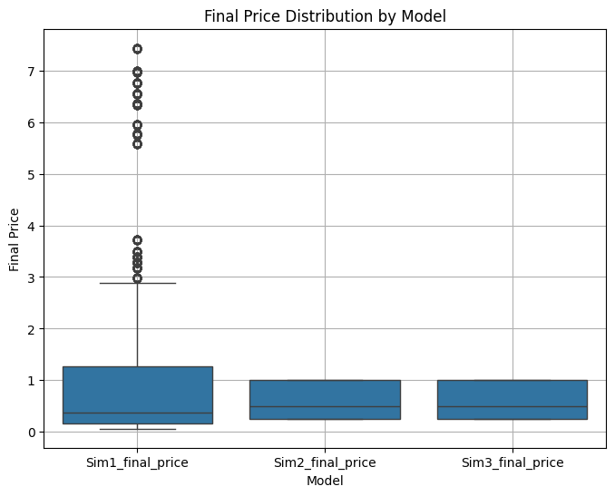
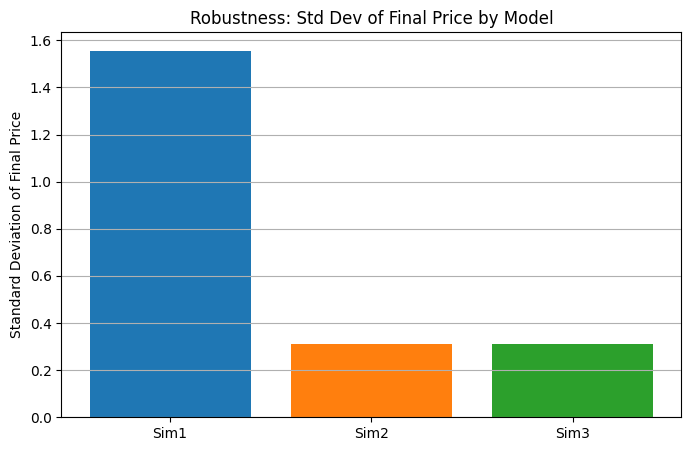

# Dria Tokenomics: Comparative Analysis & Strategic Recommendations

## 1. Introduction

This report provides a clear, actionable comparison of three tokenomics models for the Dria network. Each model was rigorously simulated across a wide range of parameters and market scenarios (Baseline, Bull, Bear, High Volatility) to assess performance, stability, and risk. The goal is to inform stakeholders about the trade-offs and suitability of each approach for Dria's future.

The models evaluated are:
*   **Model Alpha:** The current design, emphasizing compute-linked emissions and deflationary mechanisms.
*   **Model Beta:** A research-backed alternative featuring a halving-based emission schedule, performance-based rewards, and explicit governance structures.
*   **Model Gamma (BME):** A benchmark model designed to be highly responsive to broader crypto market dynamics.

## 2. Tokenomics Model Overviews

### 2.1. Model Alpha
*   **Core Idea:** Rewards linked directly to network activity and utility, with deflationary pressures from service fees.
*   **Supply & Emissions:** Capped supply with emissions primarily driven by compute demand and node participation.
*   **Key Features:** Staking for yield, token burns from service payments, value retention through locked credits.
*   **Pros:** Incentives directly tied to network usage, inherent deflationary aspects, simpler to understand and communicate.
*   **Cons:** Emission schedule can be less predictable under fluctuating demand, lacks explicit treasury and advanced governance mechanisms.

### 2.2. Model Beta
*   **Core Idea:** Predictable, Bitcoin-like emissions with a halving mechanism, performance-based rewards for network contributors, and a robust governance framework including a treasury.
*   **Supply & Emissions:** Capped supply with a pre-defined emission schedule that halves every 4 years.
*   **Key Features:** Distinct roles for contributors and validators, rewards based on uptime and FLOPs, dedicated treasury funded by emissions and fees, token-based governance.
*   **Pros:** Transparent and predictable long-term emission schedule, dedicated funding for ecosystem development, strong incentive alignment for quality service.
*   **Cons:** More complex than Model Alpha, fixed emission rate may not always perfectly align with short-term network growth or contraction.

### 2.3. Model Gamma (BME)
*   **Core Idea:** Token emissions and rewards are dynamically modulated by external market trends (e.g., overall crypto market, DePIN sector) and internal network demand.
*   **Supply & Emissions:** Highly adaptive and market-driven.
*   **Key Features:** Designed for maximum responsiveness to external economic conditions.
*   **Pros:** Potential to capitalize on broad market uptrends and self-adjust during downturns.
*   **Cons:** Inherently less predictable for long-term financial planning, potential for higher volatility if market correlations are strong and negative.

## 3. Simulation Highlights & Key Findings

Our simulations tested each model across numerous parameter combinations and four distinct market scenarios.

*   **Overall Price Performance & Potential:**
    *   **Model Beta** demonstrated the capacity for higher peak prices, especially in favorable (Bull) market conditions, but also exhibited a wider range of outcomes, including more significant downside risk in adverse scenarios.
    *   **Model Alpha** generally produced more moderate and consistent price levels, showing less extreme highs and lows.
    *   **Model Gamma** showed the most considerable price fluctuations, directly reflecting its sensitivity to simulated market trends.

*   **Stability and Robustness:**
    *   **Model Alpha** consistently showed the highest stability, with the tightest distribution of final prices across varied scenarios. This indicates greater resilience to shocks and parameter variations.
    *   **Model Beta**, while offering higher upside, was more sensitive to initial conditions and market sentiment, leading to greater variability in outcomes.
    *   **Model Gamma** was, by design, the most variable in its price outcomes.

*   **Performance Across Market Scenarios:**
    *   In **Bull Market** simulations, Model Beta (Proposal) and Model Gamma (BME) generally captured more upside potential.
    *   In **Bear Market** simulations, Model Alpha (Original) proved more defensive, maintaining value better than the more market-sensitive alternatives.
    *   **High Volatility** scenarios amplified the characteristics of each model, with Model Alpha (Original) remaining relatively more stable.

*   **Risk of "Failure" (Defined as price < $0.10 or node count < 100):**
    *   **Model Beta (Proposal)** and **Model Gamma (BME)** showed a higher number of instances where outcomes fell into this "failure" category, particularly under Bear market conditions or unfavorable parameter sets (e.g., low initial demand growth).
    *   **Model Alpha (Original)** experienced fewer such extreme negative outcomes, underscoring its robustness.

## 4. Visual Insights from Simulations

The following charts, representative of those in the `/output` directory, illustrate these key findings.

### 4.1. Final Price Distribution by Model
This boxplot visualizes the range of final DRIA prices (USD) achieved by each model across all simulated scenarios and parameter settings. A shorter box and fewer outliers (dots) suggest more consistent and predictable pricing.

### 4.2. Model Robustness (Standard Deviation of Final Price)
This bar chart compares the standard deviation of the final DRIA price for each model. A lower bar indicates less price dispersion and thus greater stability and predictability over the range of tested conditions.

### 4.3. Mean Final Price by Market Scenario
This chart displays the average final DRIA price for each model under the different simulated market scenarios (Baseline, Bull, Bear, High Volatility), highlighting their responsiveness to broader market conditions.

### 4.4. Illustrative Summary Table (Baseline Scenario Focus)

For a simplified view, focusing on a typical "Baseline" market scenario, key performance indicators conceptually compare as follows. (Detailed CSVs in `/output` provide precise data across all scenarios).

| Metric                       | Model Alpha (Original) | Model Beta (Proposal)  | Model Gamma (BME)      |
|------------------------------|-----------------------|------------------------|------------------------|
| **Avg. Final Price (USD)**   | Moderate              | Higher Potential       | Highly Variable        |
| **Price Stability**          | High                  | Medium                 | Low                    |
| **Avg. Final Node Count**    | Steady Growth         | Potential High         | Variable               |
| **Resilience to Low Demand** | Medium-High           | Medium                 | Low-Medium             |

*(Note: This table is a conceptual illustration. For exact figures and detailed breakdowns, please refer to the CSV files and full plot sets in the `/output` directory, such as `final_price_summary_stats.csv` and the per-scenario results.)*

## 5. Strategic Considerations & Recommendations

The choice of tokenomics model is a critical strategic decision that should align with Dria's specific goals, risk tolerance, and developmental stage.

*   **Model Alpha:**
    *   **Best Suited For:** Situations prioritizing stability, predictable growth, and resilience, especially in the early stages of network development or where a conservative risk profile is preferred.
    *   **Key Advantage:** Robustness against adverse conditions and simpler initial mechanics.
    *   **Considerations:** May offer less aggressive upside capture during strong bull markets compared to more dynamic models.

*   **Model Beta:**
    *   **Best Suited For:** Projects with ambitious growth targets, a clear path to significant network demand, and the capacity for active governance and treasury management. Better deployed when the network has achieved some initial traction.
    *   **Key Advantage:** Strong incentives for quality, predictable long-term supply, and a mechanism for ecosystem funding.
    *   **Considerations:** Carries higher risk if demand growth falters or in sustained bear markets. Complexity requires robust community engagement and governance.

*   **Model Gamma (BME):**
    *   **Best Suited For:** Primarily as a research benchmark or for experimental phases where understanding market correlation effects is paramount.
    *   **Key Advantage:** Maximum adaptability to external market signals.
    *   **Considerations:** Likely too unpredictable and potentially volatile for a primary production environment without substantial dampening mechanisms or further refinement.

**Recommended Path Forward:**

1.  **Review Simulation Outputs:** Stakeholders should examine the comprehensive simulation outputs (graphs, CSVs, tables) in the `/output` directory to understand performance under specific parameter sets and market conditions.
2.  **Align on Risk & Growth:** Facilitate a strategic discussion to align on the desired balance between growth potential and risk tolerance.
3.  **Consider a Phased or Hybrid Approach:** It may be prudent to launch with a more stable model (like Model Alpha) and plan a future evolution to incorporate elements from Model Beta as the network matures, governance structures solidify, and demand becomes more established.
4.  **Develop Adaptive Strategies:** Regardless of the chosen model, identify key performance indicators (KPIs) from the simulations. For Model Beta, in particular, define strategies for treasury deployment or parameter adjustments in response to real-world deviations from simulated conditions.

## 6. Conclusion

These simulations provide a data-driven foundation for making an informed decision on Dria's tokenomics. Model Alpha (Original) offers stability, Model Beta (Proposal) offers higher growth potential with managed risks, and Model Gamma (BME) serves as a valuable, market-sensitive benchmark. The optimal choice will balance Dria's strategic ambitions with a realistic assessment of market conditions and internal capacities.

---
*This report is based on recent simulation data. All referenced charts and detailed output files are located in the project's `/output` directory.* 